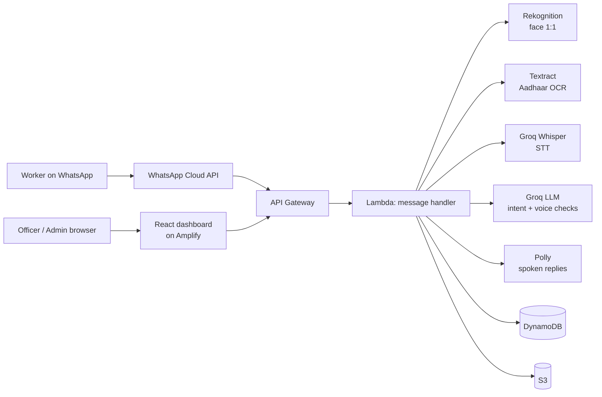

# Nirman Mitra

**Voice-first WhatsApp assistant that helps construction workers build verifiable proof of work days, and lets welfare board officers verify that proof.**

Workers check in daily with a selfie, their location, and a voice note. Each check-in is verified by three independent checks: face, geo-fence, and voice intent. Verified days add up to a digitally signed work certificate. See [PRD.md](PRD.md) for the full product requirements.

### Core Innovation: Triple Verification

Every attendance log is verified through three independent AI channels simultaneously:

| Channel | AI/Cloud Service | What It Catches |
|---|---|---|
| **Face Match** | Amazon Rekognition | Buddy-punching, fake identities |
| **Geo-Fence** | GPS + Site matching | Off-site check-ins, spoofing |
| **Voice Intent** | Groq (Whisper + LLM) | Fake check-ins, scripted messages, unintelligible audio |

### The Four Zeros

| Principle | How |
|---|---|
| **Zero Literacy** | Voice-first via WhatsApp voice notes + Amazon Polly TTS (or native text) |
| **Zero Downloads** | WhatsApp only — no app installation required |
| **Zero Contractor Dependency** | AI self-verification replaces employer sign-off |
| **Zero Typing** | Voice input + camera — no text entry required |

## Architecture



### Deliberate Architectural Decisions

| Decision | Choice | Why Not Alternative |
|---|---|---|
| **Database** | DynamoDB | RDS adds VPC cold starts and fixed costs; DynamoDB scales to zero. |
| **Compute** | AWS Lambda | EC2/ECS adds idle cost; Lambda auto-scales per webhook request. |
| **Orchestration** | AWS Step Functions | SQS chaining loses state easily; Step Functions gives visual debugging and parallel branch execution. |
| **LLM & STT** | Groq (Whisper + Llama/GPT-OSS) | Amazon Transcribe was too slow (~10-20s polling). Groq Whisper transcribes in ~1 second. |
| **Frontend** | AWS Amplify | Simplifies React CI/CD and hosting with minimal configuration. |

### Cost Analysis

| Component | Description | Cost Profile |
|---|---|---|
| Groq Whisper & LLM | Ultra-fast STT and Intent extraction | Extremely low cost / API tokens |
| Amazon DynamoDB | On-demand state management and logs | PAY_PER_REQUEST, scales to zero |
| AWS Lambda | Event-driven compute | Free tier covers most startup traffic |
| Amazon Rekognition | 1 `CompareFaces` per attendance log | ~$1.00 per 1,000 matches |
| Amazon Textract | Only during worker onboarding (Aadhaar/Passbook) | ~$1.50 per 1,000 pages |
| Amazon Polly | Text-to-Speech replies (Hindi, etc.) | Pay per character, heavily cached |

### AWS Services Utilized

- **Amazon Rekognition:** Facial verification (1:1 matching) + liveness/quality detection.
- **Amazon Textract:** OCR for Aadhaar and Bank Passbooks during onboarding.
- **Amazon Polly:** Neural TTS for voice replies in Indian languages.
- **Amazon S3:** Raw media, processed output, and generated PDF certificates.
- **Amazon DynamoDB:** User state, attendance logs, and site definitions.
- **AWS Lambda:** Serverless handlers for webhooks and business logic.
- **AWS Step Functions:** Asynchronous workflow orchestration.
- **Amazon SQS:** Decoupled webhook processing with Dead Letter Queues (DLQ).
- **Amazon API Gateway:** REST APIs for WhatsApp webhooks and Admin dashboard.
- **AWS KMS:** Encryption of sensitive data (like Aadhaar images).
- **AWS CloudFormation (SAM):** Infrastructure as Code (single `template.yaml`).
- **AWS Amplify:** Hosting for the React admin dashboard.

## Quick Start

### Prerequisites
- Node.js 20+
- AWS CLI v2 and AWS SAM CLI
- WhatsApp Cloud API App (Meta Developer Console)
- Groq API Key

### Configuration
Copy `.env.example` to `.env` and fill in your values. Never commit real secrets. In AWS, these values are passed to the stack via SAM parameters (`NoEcho`).

### Deploy Backend

```bash
# Install dependencies
npm install

# Build the Lambda functions
sam build

# Deploy (first time requires --guided to set parameters)
sam deploy --guided
```

After deploying:
1. Set the stack output `WhatsAppWebhookUrl` as the callback URL in your Meta app.
2. Use the exact verify token you passed as `WhatsAppVerifyToken`.
3. Subscribe the webhook to the `messages` field.

### Deploy Frontend (Local Dev)

```bash
cd admin-dashboard
npm install
echo "VITE_API_URL=<your-api-gateway-endpoint>" > .env
npm run dev
```
*Note: To deploy the dashboard to production, you can link the `admin-dashboard` directory to an AWS Amplify app.*

### Create the First Admin User
```bash
curl -X POST "$API_URL/api/auth/seed" \
  -H "Content-Type: application/json" \
  -d '{"email":"admin@example.com","password":"<strong-password>","name":"Admin","seedSecret":"<AdminSeedSecret>"}'
```

### Demo Mode

The project runs in demo mode by default if `ENVIRONMENT=dev`:
- **Demo Keywords:** Supported phone numbers can trigger quick demo paths.
- **Certificate Threshold:** Set to **3 days** (instead of 90) for quick demonstrations.
- **Voice Fallback:** If audio is too short, mock demo transcriptions are returned.

## Project Structure

```
nirman-mitra/
  ├── PRD.md                    # Product requirements and specs
  ├── template.yaml             # AWS SAM template (API, Lambdas, tables, buckets)
  ├── src/
  │   ├── handlers/             # Lambda entry points (webhook, attendance, certs, admin API)
  │   ├── services/             # Business logic (registration, document OCR, voice processing)
  │   ├── providers/llm.js      # LLM provider interface (Groq API)
  │   ├── middleware/auth.js    # JWT verification for the admin API
  │   ├── stepFunctions/        # AWS Step Functions state machine definitions (ASL)
  │   └── utils/                # Config, DynamoDB, S3, WhatsApp client, helpers
  └── admin-dashboard/          # React + Vite admin dashboard and verify page
```

## Security & Privacy
- **KMS Encryption:** Sensitive documents like Aadhaar are encrypted at rest.
- **PII Masking:** Only the last 4 digits of Aadhaar are stored in the database.
- **Least-privilege IAM:** Each Lambda function has a dedicated execution role with strict permissions.
- **S3 Public Access Blocked:** All backend buckets are strictly private.

## Team

**StrawHats** | NITK Build for Billions Hackathon
