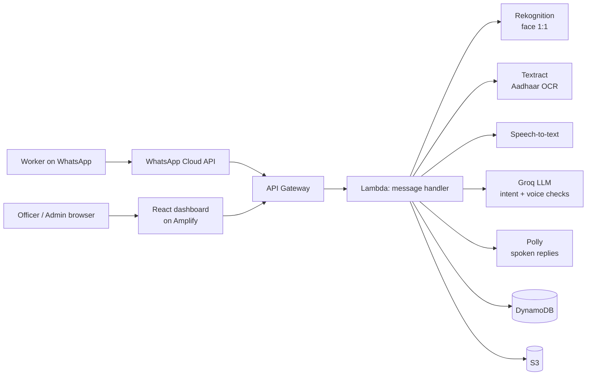

# Nirman Mitra

Voice-first WhatsApp assistant that helps construction workers build verifiable proof of work days, and lets welfare board officers verify that proof.

Workers check in daily with a selfie, their location and a voice note. Each check-in is verified by three independent checks: face, geo-fence and voice intent. Verified days add up to a work certificate. See [PRD.md](PRD.md) for the full requirements.

## Architecture



## Tech stack

| Layer | Technology |
|---|---|
| Messaging | WhatsApp Cloud API (webhooks authenticated with `X-Hub-Signature-256`) |
| Backend | Node.js 20, AWS Lambda, API Gateway, AWS SAM |
| Data | DynamoDB (on-demand), S3 (SSE-S3 encryption) |
| AI | Amazon Rekognition, Textract, Transcribe, Polly; Groq (`openai/gpt-oss-120b`) through `src/providers/llm.js` |
| Frontend | React 18 + Vite, hosted on AWS Amplify |
| Auth | JWT access + refresh tokens for the admin dashboard |

## Repository layout

```
├── PRD.md                    Product requirements
├── template.yaml             AWS SAM template (API, Lambdas, tables, buckets)
├── src/
│   ├── handlers/             Lambda entry points (webhook, attendance, certificates, admin API, …)
│   ├── services/             Registration, document OCR, voice processing
│   ├── providers/llm.js      LLM provider interface (Groq)
│   ├── middleware/auth.js    JWT verification for the admin API
│   ├── stepFunctions/        State machine definitions
│   └── utils/                Config, DynamoDB, S3, WhatsApp client, helpers
└── admin-dashboard/          React admin dashboard and certificate verification page
```

## Getting started

### Prerequisites
- Node.js 20+
- AWS CLI v2 and AWS SAM CLI (for backend deploys)
- A WhatsApp Cloud API app (Meta developer console) and a Groq API key

### Configuration
Copy `.env.example` to `.env` and fill in the values. Never commit real secrets. In AWS, the same values are passed to the stack as SAM parameters; all secret parameters are `NoEcho`.

### Admin dashboard (local)
```bash
cd admin-dashboard
npm install
echo "VITE_API_URL=<your API endpoint>" > .env
npm run dev
```

### Backend
```bash
npm install
sam build
sam deploy --guided   # first time; prompts for parameters
```

After deploying:
1. Set the stack output `WhatsAppWebhookUrl` as the callback URL in the Meta app.
2. Use the same verify token you passed as `WhatsAppVerifyToken`.
3. Subscribe the webhook to the `messages` field.

### Create the first admin user
```bash
curl -X POST "$API_URL/api/auth/seed" \
  -H "Content-Type: application/json" \
  -d '{"email":"admin@example.com","password":"<strong password>","name":"Admin","seedSecret":"<AdminSeedSecret>"}'
```

## Environment variables

| Variable | Purpose |
|---|---|
| `WHATSAPP_API_TOKEN`, `WHATSAPP_PHONE_NUMBER_ID` | Send messages through the WhatsApp Cloud API |
| `WHATSAPP_VERIFY_TOKEN` | Webhook verification handshake |
| `WHATSAPP_APP_SECRET` | Validates webhook signatures |
| `GROQ_API_KEY`, `LLM_PROVIDER`, `LLM_MODEL` | LLM provider configuration |
| `JWT_SECRET`, `JWT_REFRESH_SECRET` | Admin session tokens |
| `ADMIN_SEED_SECRET` | Required to create admin users |
| `CERTIFICATE_THRESHOLD` | Verified days needed for a certificate (3 for demos, 90 in production) |
| `VITE_API_URL` | API endpoint used by the dashboard |

## Team

StrawHats
