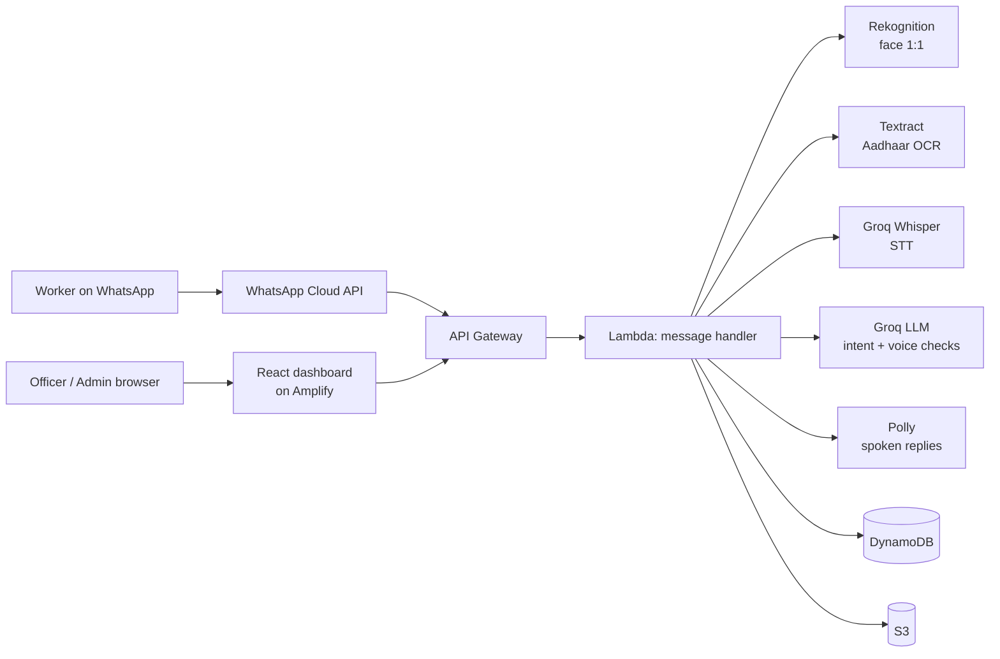

# Nirman Mitra

**Proof of work days for construction workers, built on WhatsApp**

Voice-first on WhatsApp | English, Hindi, Kannada

> **NITK Build for Billions 2026** | Team StrawHats

---

## The Problem

A construction worker can register with their state welfare board, and so qualify for its benefits, only after proving **90 days of building work in the past 12 months** [[R2]](docs/REFERENCES.md#problem-statistics). That proof usually needs a contractor's signature, and the contractor has every reason not to sign.

The system fails in both directions: genuine workers are turned away, fake ones get paid, and the money sits unspent. One cause is that nobody can verify a day of work.

| Metric                                  | Figure                                                                                                                        |
| --------------------------------------- | ----------------------------------------------------------------------------------------------------------------------------- |
| Construction workers in India           | 7.1 crore working in the sector, 5.65 crore registered [[R1]](docs/REFERENCES.md#problem-statistics)                           |
| Genuine workers turned away (Haryana)   | 10,81,809 applied between 2018 and Jan 2025; **8,06,148 rejected** [[R3]](docs/REFERENCES.md#problem-statistics)               |
| Fake workers on the rolls (Karnataka)   | **19 lakh of 51 lakh** cards cancelled as bogus [[R4]](docs/REFERENCES.md#problem-statistics)                                  |
| Welfare cess collected but unspent      | **About ₹48,000 crore** (₹1,12,331 crore collected, 57.15% spent, as on 31 Mar 2024) [[R5]](docs/REFERENCES.md#problem-statistics) |

## The Solution

Nirman Mitra ("builder's friend") is a voice-first assistant on WhatsApp. It works in four steps:

1. **Check in daily:** the worker sends a selfie, their current location and a short voice note.
2. **Automatic verification:** each check-in is checked at once.
3. **Credential:** when enough days are verified, the worker receives a **digitally signed work credential** with a QR code.
4. **Officer verification:** a welfare board officer scans the QR and the signature is verified **in the browser, with no call to our server**.

No app to install, no forms, and no contractor sign-off.

### Core Innovation: Triple Verification

Every check-in goes through three independent checks, run in parallel:


| Channel          | Service                                                             | What It Catches                              |
| ---------------- | ------------------------------------------------------------------- | -------------------------------------------- |
| **Face Match**   | Amazon Rekognition (1:1 against the enrolled selfie)                | Proxy check-ins, wrong person                |
| **Geo-Fence**    | WhatsApp current location + distance to the nearest registered site | Off-site check-ins                           |
| **Voice Intent** | Groq Whisper (speech-to-text) + LLM check                           | Empty or scripted notes, replayed recordings |

**Decision rules:**


| Result            | When                                                                                              |
| ----------------- | ------------------------------------------------------------------------------------------------- |
| **Auto-approved** | Face ≥ 60, location ≥ 60,**and** a spoken note that describes work and says the one-time number |
| **Rejected**      | Face < 30, more than 2× the site radius away, or the wrong one-time number                       |
| **Admin review**  | Anything else. The worker gets a WhatsApp message when the reviewer decides.                      |

### Anti-Misuse


| Misuse                           | How it is caught                                               |
| -------------------------------- | -------------------------------------------------------------- |
| Re-sending an old selfie         | Image hash compared with the worker's recent check-ins         |
| Forwarded photo or voice note    | WhatsApp's forwarded flag; rejected                            |
| Picking a place on the map       | Only "current location" is accepted; pinned places are refused |
| Replaying an old voice note      | A random two-digit number must be spoken in every check-in     |
| Typing instead of speaking       | Allowed, but only a spoken note can auto-approve               |
| Selfie now, location hours later | All three parts must arrive within 10 minutes                  |
| Two check-ins in a day           | One record per worker per IST date (conditional write)         |

**Known gaps:** mock-location apps, edited gallery photos, photos of a screen, and one person holding two numbers. Each gap and its planned fix is listed in [PRD §8](PRD.md#8-known-gaps-anti-misuse-roadmap).

### The Four Zeros


| Principle                      | How                                                                                               |
| ------------------------------ | ------------------------------------------------------------------------------------------------- |
| **Zero Literacy**              | Voice notes in; spoken replies out (Amazon Polly, in Hindi and English); buttons for every choice |
| **Zero Downloads**             | WhatsApp only                                                                                     |
| **Zero Contractor Dependency** | Self-verification replaces the employer's signature                                               |
| **Zero Typing**                | Camera, location button and voice cover the daily flow                                            |

Polly has no Kannada voice yet, so Kannada replies are text only.

## Architecture



### Deliberate Architectural Decisions


| Decision           | Choice                                                                      | Why Not the Alternative                                                             |
| ------------------ | --------------------------------------------------------------------------- | ----------------------------------------------------------------------------------- |
| **Channel**        | WhatsApp Cloud API                                                          | A separate app means an install, storage space and a new interface to learn         |
| **Compute**        | AWS Lambda                                                                  | No idle servers; scales per webhook                                                 |
| **Async work**     | Webhook acknowledges at once, then the Lambda invokes itself asynchronously | Meta retries slow webhooks; the three checks then run in parallel in one invocation |
| **Database**       | DynamoDB, on-demand                                                         | No VPC or fixed cost; conditional writes stop duplicate check-ins                   |
| **Speech-to-text** | Groq Whisper                                                                | Amazon Transcribe batch jobs need to be polled; Whisper returns in a single call    |
| **LLM**            | Groq`openai/gpt-oss-120b` behind a provider interface                       | Pay per token; the provider can be swapped in one file                              |
| **Credential**     | ES256-signed JWT, public key published as`did:web`                          | Officers verify offline in the browser; no lookup against our server                |
| **Frontend**       | React + Vite on AWS Amplify                                                 | Builds and deploys on every push                                                    |
| **Region**         | ap-south-1 (Mumbai)                                                         | Closest to the users                                                                |

### Cost

Estimated at list prices; the full working and price sources are in [docs/REFERENCES.md](docs/REFERENCES.md#cost-per-check-in-working).


| Component                                    | Per check-in (USD) |
| -------------------------------------------- | ------------------ |
| Polly spoken replies (about 250 characters)  | 0.00400            |
| Rekognition face match                       | 0.00125            |
| Groq LLM voice check (upper bound)           | 0.00057            |
| Groq Whisper (15-second note)                | 0.00017            |
| Lambda, API Gateway, DynamoDB                | 0.00024            |
| WhatsApp replies (inside the service window) | 0                  |
| **Total**                                    | **≈ 0.0062**      |

**About $0.14 per worker per month** (22 check-ins), or about **$1,370 per month for 10,000 workers**. Spoken replies are about 65% of that, and caching fixed phrases would remove most of it.

## Quick Start

### Prerequisites

- Node.js 20+
- AWS CLI v2 and AWS SAM CLI
- A WhatsApp Cloud API app (Meta for Developers)
- A Groq API key

### Configuration

Copy `.env.example` to `.env` and fill in your values. Never commit real secrets. In AWS, the same values are passed to the stack as SAM parameters (`NoEcho`).

### Deploy Backend

```bash
npm install
sam build
sam deploy --guided   # first deploy; asks for the parameters
```

After deploying:

1. Set the stack output `WhatsAppWebhookUrl` as the callback URL in your Meta app.
2. Use the same verify token you passed as `WhatsAppVerifyToken`.
3. Subscribe the webhook to the `messages` field.

Pushing to `master` runs the tests and deploys the backend and dashboard through GitHub Actions.

### Run the Dashboard Locally

```bash
cd admin-dashboard
npm install
echo "VITE_API_URL=<your-api-gateway-endpoint>" > .env
npm run dev
```

### Create the First Admin User

```bash
curl -X POST "$API_URL/api/auth/seed" \
  -H "Content-Type: application/json" \
  -d '{"email":"admin@example.com","password":"<strong-password>","name":"Admin","seedSecret":"<AdminSeedSecret>"}'
```

### Tests

```bash
npm test      # node:test suites with mocked AWS, WhatsApp and Groq
npm run lint
```

### Demo Settings

- **Certificate threshold:** 3 verified days instead of 90 (`CertificateThreshold`).
- **Team shortcuts:** only numbers listed in `DEMO_PHONE_NUMBERS` can use the demo keywords.

## Project Structure

```
nirman-mitra/
  ├── README.md
  ├── PRD.md                    # Product requirements, anti-misuse rules, known gaps
  ├── docs/REFERENCES.md        # Sources for every number in this README
  ├── template.yaml             # AWS SAM template (API, Lambdas, tables, buckets)
  ├── src/
  │   ├── handlers/             # Lambda entry points: webhook, attendance, certificates, admin and company API
  │   ├── services/             # Registration, consent, signed credential, OCR, voice, audit
  │   ├── providers/llm.js      # LLM provider interface (Groq)
  │   ├── middleware/auth.js    # JWT verification for the admin API
  │   └── utils/                # Config, DynamoDB, S3, WhatsApp client, translations
  ├── tests/                    # node:test suites
  └── admin-dashboard/          # React + Vite: admin, company and officer verification portal
```

## Security & Privacy

- **Consent first:** no selfie, document or voice is collected until the worker taps "I agree" on a short notice in their language. The consent is recorded.
- **Aadhaar:** only the last 4 digits are stored. The full number is checked with the Verhoeff checksum in memory, then discarded. The card image and number are never sent to an LLM.
- **Masked data:** phone numbers are masked in admin and company views.
- **Audit log:** every officer view and every approve or reject decision is written to an append-only audit log.
- **Webhook authentication:** requests are checked against Meta's `X-Hub-Signature-256`; the admin API sits behind JWT.
- **Storage:** all buckets are encrypted at rest (SSE-S3, AES-256) and block public access.
- **Least privilege:** each Lambda function gets only the table and bucket permissions it uses.

## Impact


| SDG                            | Contribution                                                                                                               |
| ------------------------------ | -------------------------------------------------------------------------------------------------------------------------- |
| SDG 1 · No Poverty            | Opens a route for workers to the about ₹48,000 crore of welfare cess still unspent [[R5]](docs/REFERENCES.md#problem-statistics) |
| SDG 8 · Decent Work           | Gives workers a verifiable record of their days worked                                                                     |
| SDG 10 · Reduced Inequalities | Voice-first design for workers who cannot read or type                                                                     |
| SDG 16 · Strong Institutions  | Signed, audited credentials that officers can check without trusting a middleman                                           |

## Team

**StrawHats** | NITK Build for Billions
